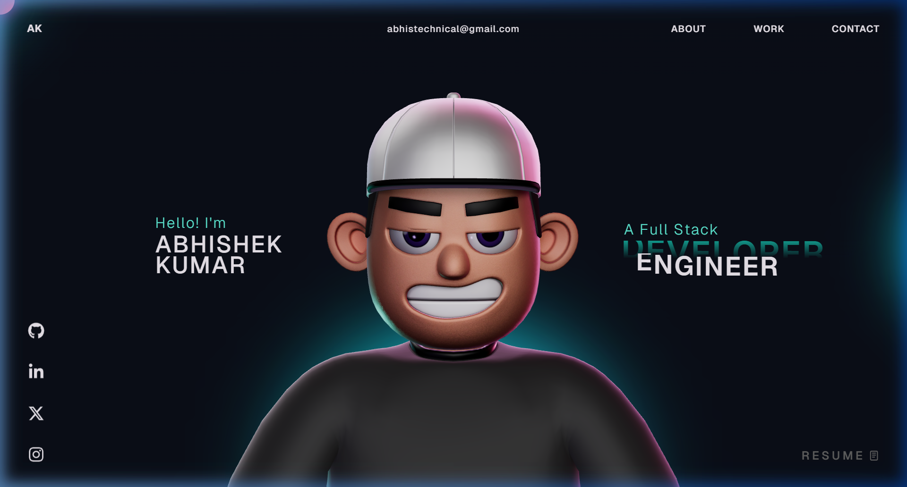

# Abhishek Kumar Portfolio Website - Overview 🚀

This repository contains the open-source version of my portfolio website.
Experience the interactive 3D elements and smooth animations!

## Features ✨

- **Interactive 3D Scenes**: Built with Three.js and React-Three-Fiber.
- **Fluid Animations**: High-performance animations powered by GSAP.
- **Dynamic Content**: Modular design using React and TypeScript.
- **Mobile Responsive**: Fully optimized for various screen sizes.

## Important Note 🔴

I have modified the GSAP club plugins with the trial versions. Please note that the trial plugins cannot be used for production hosting. For Club plugins, check out the [GSAP Installation Guide](https://gsap.com/docs/v3/Installation/).

### Preview 🖼️

## License

This project is open-source and available under the [MIT License](LICENSE).
